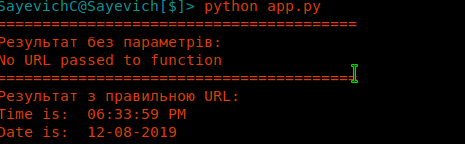
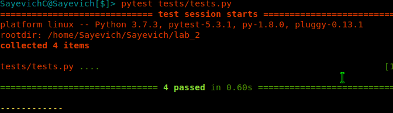
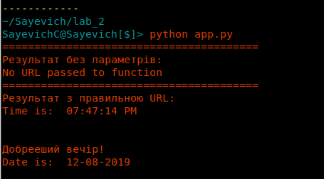
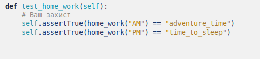
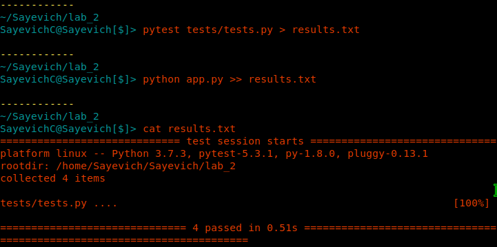

1. створюю папку lab_2.
2. Встановлюю pipenv та створив середовище
3. Встановив бібліотеки
4. Створив та заповнив файл `app.py`
5. запустив програму:

6. Встановив `pytest` бібліотеку.
7. Запустив тести:

8. Дописав функцію що перевіряє час доби та виводить привітання:

9. Написав тести, що перевіряють правильність виконання:

10. Перенаправив результати виконання тестів та програми у файл `results.txt`:

11. Зробив файл Makefile та коміт.