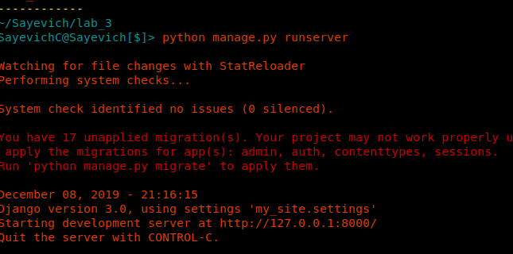
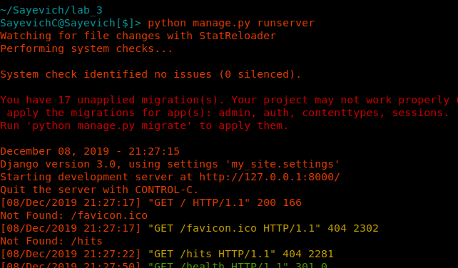
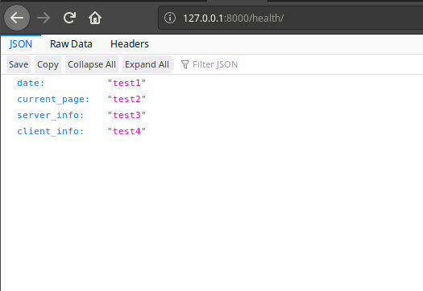

1. Створюю папку з лабораторною `lab_3`. Ініціалізую середовище. Інсталюю django бібліотеку.
2. Створюю заготовку за доп. django framework. (my_site). Виношу файли на рівень вище.
3. Запускаю сервер:

4. Створюю коміт з базовим темплейтом. Додаю `.gitignore` та записую в цей файл назву `db.sqlite3`, щоб git не комітив `db.sqlite3` до репозиторію. Роблю коміт.
5. Створюю темлейт додатку. Роблю коміт.
6. Створив `main/templates/main.html` та `main/urls.py`. Роблю коміт.
7. Вказав де шукати сторінки, додав `main` до `INSTALLED_APPS`. Вношу зміни у файл `my_site/urls.py` за зразком.
8. Створив файл `main/views.py` та заповнив його.
9. Створюю файл `main/urls.py` за зразком.
10. Запускаю сервер:

