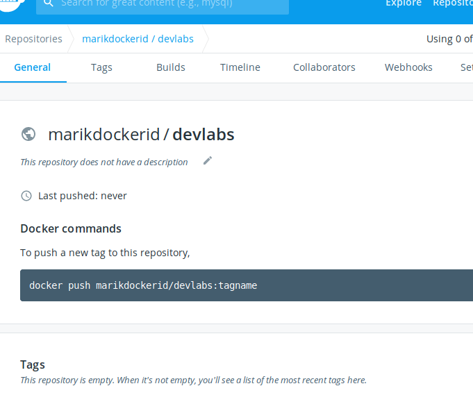
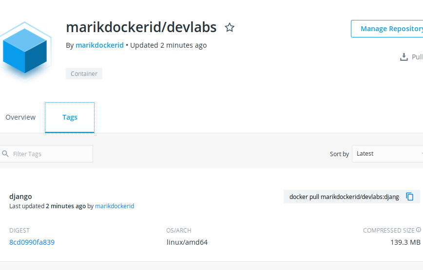
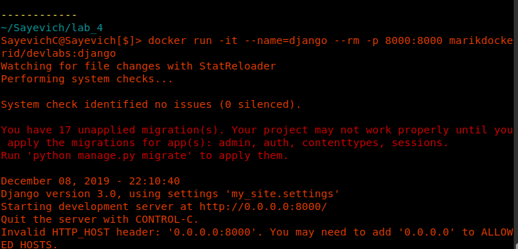
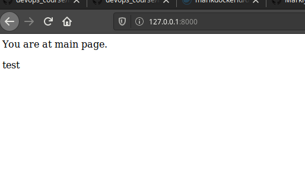

1. Прочитав документацію
2. Заповнив `my_work.log` та зробив коміт.
3. Можна бачити. Ознайомився з документацією
4. Відредагував `Dockerfile`. Зробив коміт.
5. Створив власний репо на DockerHub:

6. Виконав білд docker image та завантажив до [репозиторію](https://hub.docker.com/r/marikdockerid/devlabs) :

7. Запустив сервер:

8. завдання:
* створив ще один Dockerfile для програми моніторингу. Дав назву `Dockerfile.monit`
* виконав білд: `docker build -t marikdockerid/devlabs:monitoring --file Dockerfile.monit .`
* запустив два контейнери одночасно. Для контейнера моніторингу дав ключ `--net=host`:

* Витягнув логи додавши ключ для моніторингу `-v save:/app` та створивши volume. Потім скопіював файл логів з запущеного контейнера.