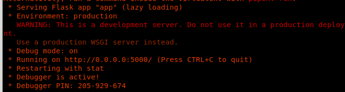
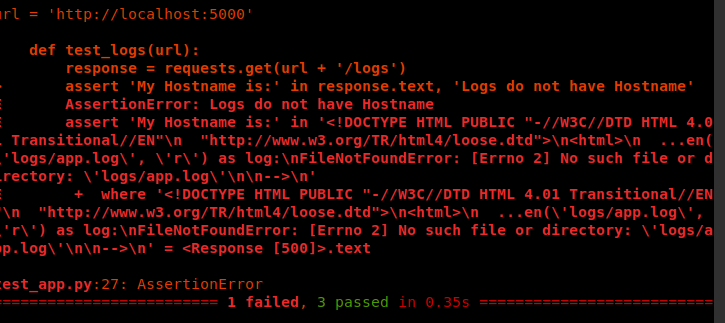
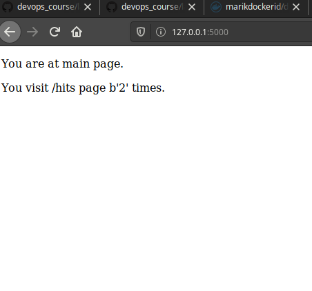
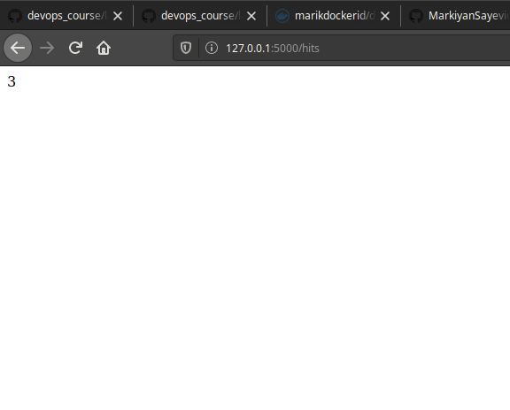
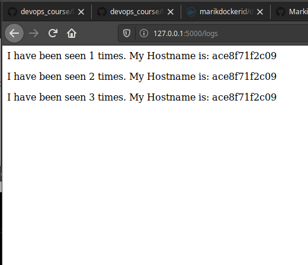

1. Читаю про Docker compose.
2. Читаю про Flask
3. Rodger!
4. Roger!
5. Створив папку `my_app`. Створив папку `tests`. Скопіював файли з репозиторію. Файл `requirements.txt` містить список бібліотек: flask, redis, requests, pytest.
6. Працездатність:

- Тести не пройшли успішно:

7. Видалив файли що створились. Створив два Dockerfile та Makefile.
8. Ознайомився з вмістом файлів. Makefile:
- На початку йде декларація двох змінних, одна містить цілі, інша - назву репозиторію
- директива `.PHONY` - помічає цілі як 'несправжні'
- директива `$(STATES):` - описує дії що необхідно виконати для створення імеджів для `app` і `tests`
- директива `run` - запускає контейнери з сервером та піднімає мережі
- директива `test-app` - запускає тести
- `docker-prune` - очищає всі контейнери та імеджі що не використовуються
9. Створив DOcker імеджі командою `make tests app`. Зробив скріни сторінок:

10. Зупинив проект та почистив всі ресурси `make docker-prune`.
11. Створив директиву для завантаження імеджів у dockerhub - `make upload`
12. Видалив створені та закачані імеджі. Створив директиву для цього: `make docker-trash`
13. Створив `docker-compose.yml` та заповнив його по зразку. Обидві мережі використовуються для спільного мережевого доступу котейнерів. Контейнери обежені призначеними для них мережами і не мають доступу до інших. Це зроблено в цілях безпеки?
14. Запустив docker-compose.
15. Потрібно зайти на `localhost:80`
16. Змінив теги імеджів на власні та перезапусти docker-compose.
17. Зупинив проект
18. Завантажив імеджі
19. Для роботи з докером краще звісно `docker-compose`, але якщо спектр задач які необхідно виконати ширший ніж просте створення та запуск контейнерів, то краще скористатись `Makefile`. Також можливий комбінований варіант у якому використовуються обидва файли.
20. Створив docker-compose.yml для лабораторної 4.