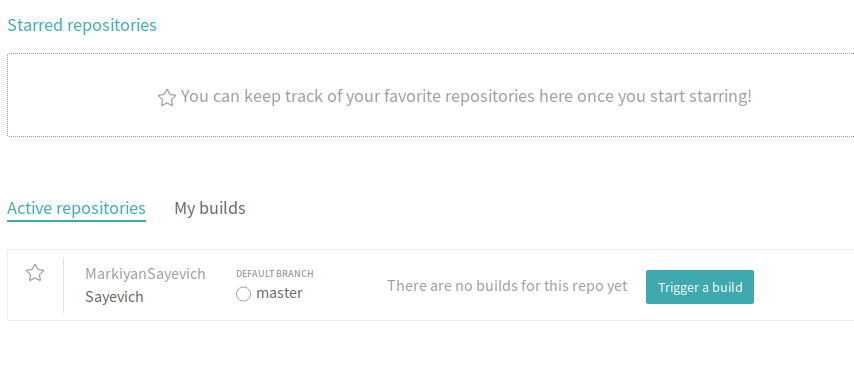

1. Переглянув стартову сторінку
2. Переглянув документацію
3. Додав репозиторій до travis:

4. Створив файл `travis.yml`. Скопіював вміст.
5. Прочитав документацію
6. Переписав білди травісу для кожної лабораторної. [Посилання на травіс білд](https://travis-ci.org/MarkiyanSayevich/Sayevich).
